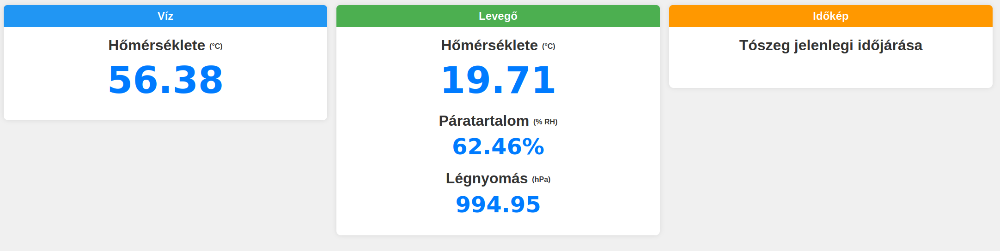

# IOT - Jacuzzy measurement

This project contains the code for monitoring a jacuzzi using an ESP8266 microcontroller, along with a test environment for development and alerting purposes. The project includes temperature, humidity, and pressure monitoring, with alerts triggered via email when certain thresholds are exceeded.

## Getting Started

To launch the test environment:

1. Navigate to the environment folder:
   ```bash
   cd environment/
   docker compose up
   ```

Three basic alerts are defined in the alerting rules, which notify the user via email when triggered.

The HTML page (with its corresponding CSS file) is located under the `webpage/` folder for development purposes.

## Dependencies

- OneWire (2.3.8)
- DallasTemperature (3.9.0)
- Adafruit Unified Sensor (1.1.14)
- Adafruit SH110X (2.1.11)
- Adafruit GFX Library (1.11.10)
- Adafruit BusIO (1.16.1)
- Adafruit BMP280 Library (2.6.8)
- Adafruit AHTX0 (2.0.5)

## Used devices & sensors

- ESP8266MOD D1 mini (1x)
- AHT20/BMP280 (1x)
- DS18B20 (1x)
- 10 kOhm resistor (1x)

## Wiring diagram

| **ESP8266 D1 Mini Pin** 	| **AHT20/BMP280 Pin** 	|
|:-------------------------:|:---------------------:|
|     D1 (GPIO5, SCL)     	|          SCL         	|
|     D2 (GPIO4, SDA)     	|          SDA         	|
|           3.3V          	|          VCC         	|
|           GND           	|          GND         	|

**10k Ohm resistor** is needed between 3.3V and Yellow, data line (D7)

| **ESP8266 D1 Mini Pin** 	| **DS18B20**   	|
|:-------------------------:|:-----------------:|
|            D7           	| Yellow (Data) 	|
|           3.3V          	|   Red (VCC)   	|
|           GND           	|  Black (GND)  	|

## Screenshots


